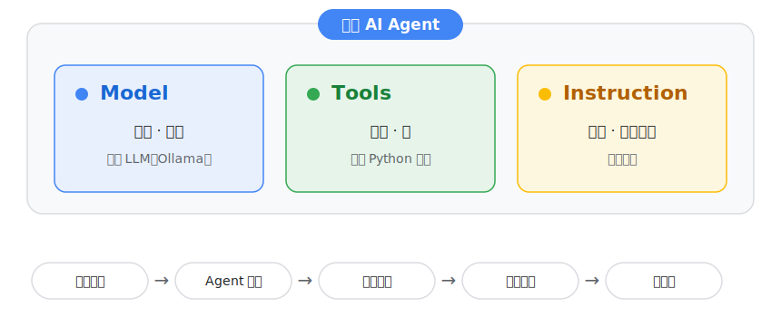
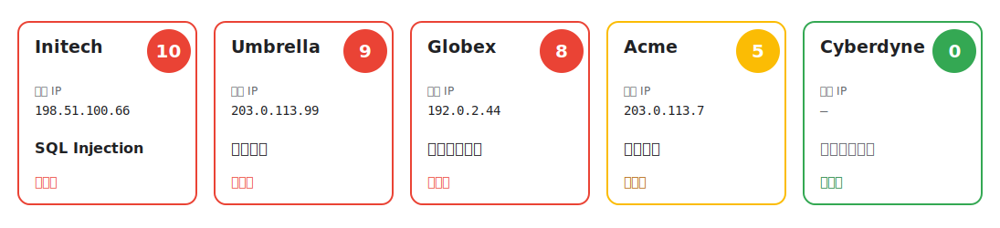
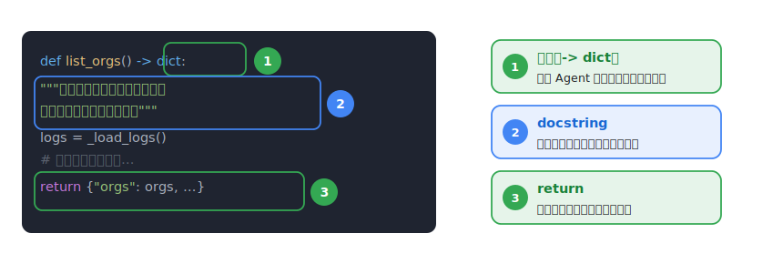
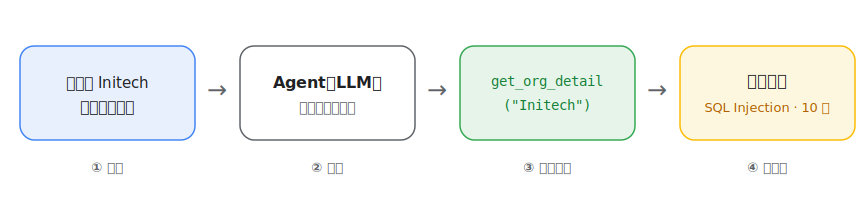
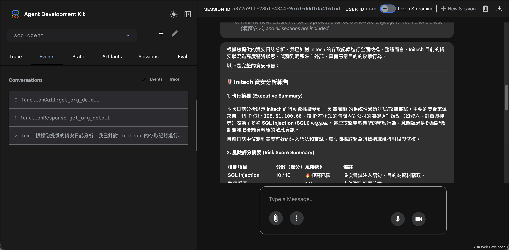
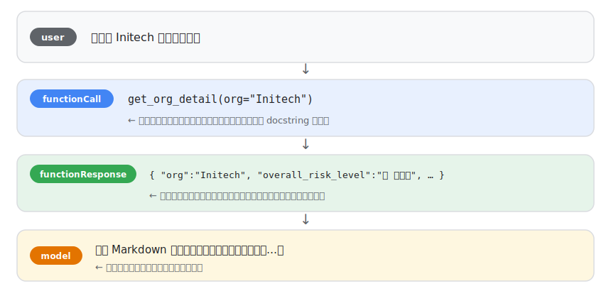
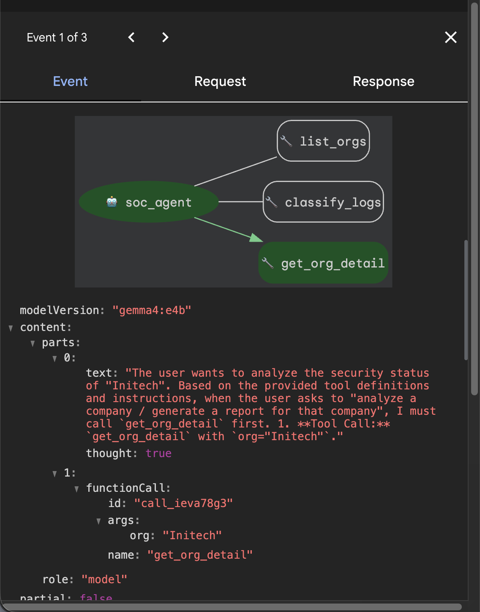
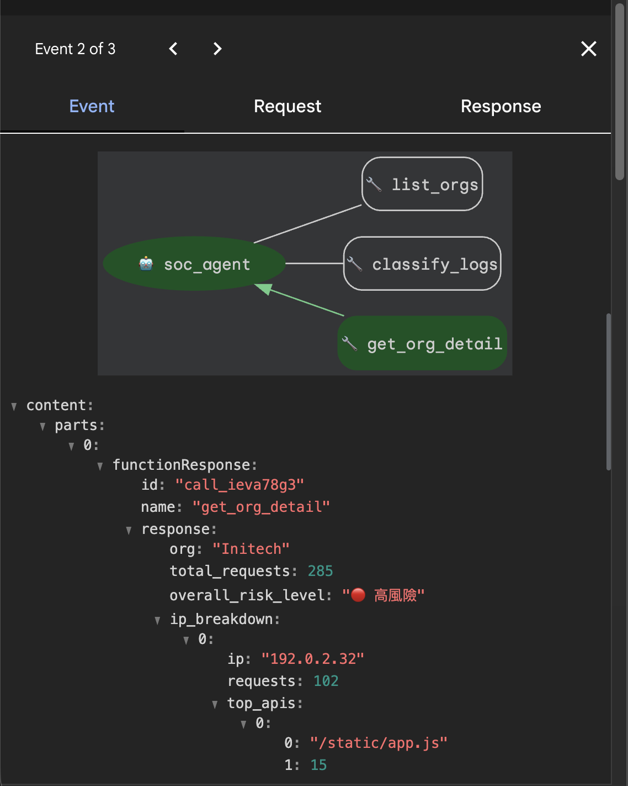
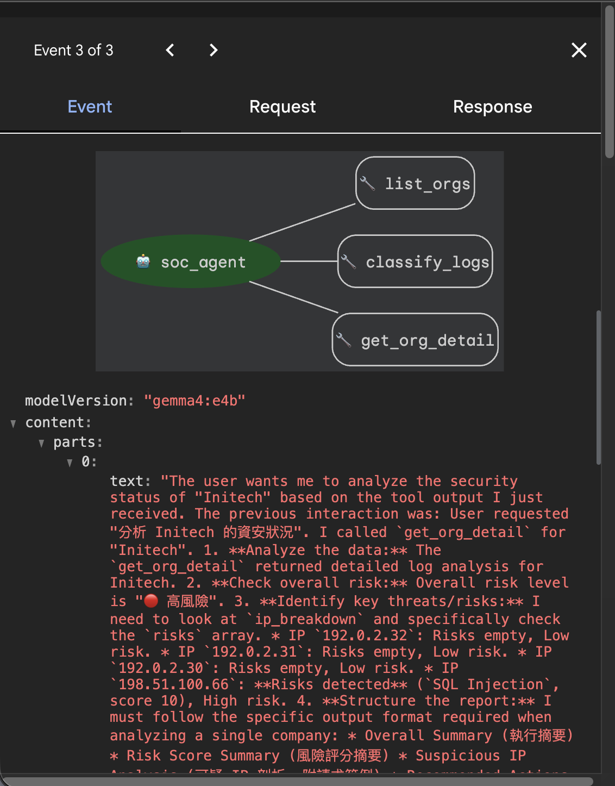

<p align="center"></p>

# 用 Google ADK ＋ 地端 LLM 打造你的第一支資安分析 AI Agent

這份講義是給你自己照著做的。我們會從零打造一支「資安日誌分析 Agent」——做完之後，你只要用一句話，它就能幫你把一大包網站存取紀錄分類、找出可疑的攻擊、再寫成一份資安報告。而且整堂課的 AI 模型都跑在你自己的電腦上（地端 LLM）——資安日誌這種敏感資料，本來就不該隨便送上雲端。

跟著關卡一步步做就好。每個關卡結束會告訴你「應該看到什麼」，讓你確認自己沒有跟丟；如果卡住，下面也都附了常見狀況的解法。全部做完，你會有一支真的能跑的 Agent，最後還可以動手改成你自己的題目。

這堂課你會弄懂三件事：AI Agent 跟一般聊天機器人差在哪、ADK 的三個組成（模型、工具、指令），以及怎麼把它們兜成一支會自己動手的 Agent。

---

## 先建立一個觀念

聊天機器人只會「回話」；Agent 會「判斷 → 呼叫工具 → 拿到結果 → 再回話」。差別就在它會不會**自己動手做事**。

在 ADK 裡，一支 Agent 由三個部分組成，這張圖整堂課都會用到：



*圖 1：一支 AI Agent 由「模型、工具、指令」三個部分組成。你說人話，它判斷後呼叫工具，再把結果回覆給你。*

- **Model（模型）**：它的大腦，負責思考。今天用地端 LLM——透過 Ollama 跑在你自己電腦上的開源模型，資料不出門。
- **Tools（工具）**：它的手，就是我們等一下用 Python 寫的幾個函式。
- **Instruction（指令）**：它的工作守則，一段文字，告訴它什麼時候該用哪個工具。

這是 ADK 的詳細教學，如果有興趣可以再深究：[Build and deploy a Python AI agent to Cloud Run](https://codelabs.developers.google.com/codelabs/cloud-run/tools-make-an-agent?hl=zh-tw#0)

---

## 關卡 0：準備環境

[前置作業](https://justin0427.github.io/gdg-adk-demo/docs/PREWORK.html)應該已經把 Python 環境、Ollama、模型（`gemma4:e4b`，記憶體較少的人是 `gemma4:e2b`）都裝好了。先啟動這個專案的虛擬環境：

```bash 終端機
.venv\Scripts\activate
```

確認一下：終端機前面出現 `(.venv)`，代表你已經進入這個專案的乾淨 Python 環境。

接著跑一次環境健檢，一個指令幫你檢查七件事（Python 版本、兩個套件、adk 指令、示範資料、LLM 服務連線、模型）：

```bash 終端機
python check_env.py
```

確認一下：健檢顯示全部 [OK] 就緒。「示範資料」那一項要到關卡 1 之後才會過，現在紅的很正常。

如果出問題：[前置作業](https://justin0427.github.io/gdg-adk-demo/docs/PREWORK.html)沒做完的人，回頭照著補完就好——`.venv` 沒建立過就先跑 `python -m venv .venv` 再 `pip install -r requirements.txt`；模型沒下載就跑 `ollama pull gemma4:e4b`（記憶體只有 8GB 或以下的人，改跑 `ollama pull gemma4:e2b`）。每個 [FAIL] 下面也都印了「修法」，照做即可；模型相關的項目沒過也沒關係，關卡 1 到 3 完全用不到模型，可以先往下做。

---

## 關卡 1：產生要分析的資料

我們用一支小程式，產生一份「長得像真的、但完全是假資料」的存取日誌：

```bash 終端機
python generate_logs.py
```

應該看到：

``` 預期輸出（看的，不用貼）
已產生 1735 筆合成日誌 → .../data/access_logs.json
內含 4 種容易辨識的可疑行為：SQL Injection / 路徑遍歷 / 敏感路徑掃描 / 高頻爬取
```

打開 `data/access_logs.json` 看其中一筆，認識三個關鍵欄位：

```json data/access_logs.json（範例，看的不用改）
{ "time": "2025-06-01T02:13:00.000Z",
  "org": "Initech",
  "role": "guest",
  "api": "/api/orders?id=1 UNION SELECT username,password FROM users",
  "method": "GET",
  "ip": "198.51.100.66" }
```

`org` 是哪家公司，這是我們分類的依據；`api` 是它存取的網址路徑，攻擊特徵就藏在這裡；`ip` 是誰來的。

這批資料裡我們偷偷藏了四個明顯壞人：有人在打 SQL Injection、有人在猜檔案路徑、有人在掃後門、有人在瘋狂爬資料——這四個都留下了明顯的痕跡，等一下就是要讓 Agent 自己把他們揪出來。



*圖 2：五家公司裡，前四家各埋了一種容易辨識的攻擊，第五家 Cyberdyne 看起來乾淨、風險分數是零——等一下讓 Agent 自己找出來。*

---

## 關卡 2：打造 Agent

repo 裡的 `soc_agent/agent.py` 已經是完成版（方便你日後直接使用），但課堂上我們要從零打造。先執行：

```bash 終端機
python reset.py start
```

它會把完成版備份成 `agent.py.bak`，換成一份只有段落標記的空白骨架。接下來把每一塊程式碼，照順序貼進對應標記底下。我會邊貼邊說明為什麼要這樣寫。

記住這條保命指令：任何時候卡住、改壞了、跟不上，執行 `python reset.py done` 就會立刻回到完成狀態，直接跟上進度。

### 2-1　地基：載入套件、設定模型、讀資料

```python soc_agent/agent.py
import os
import re
import json
from datetime import datetime
from collections import defaultdict

from google.adk.agents import Agent
from google.adk.models.lite_llm import LiteLlm

# 模型：走本機 Ollama 的 OpenAI 相容介面（可用環境變數覆寫）
OLLAMA_API_BASE = os.getenv("OLLAMA_API_BASE", "http://localhost:11434/v1")
OLLAMA_API_KEY = os.getenv("OLLAMA_API_KEY", "ollama")
OLLAMA_MODEL = os.getenv("OLLAMA_MODEL", "gemma4:e4b")
os.environ["OPENAI_API_BASE"] = OLLAMA_API_BASE
os.environ["OPENAI_API_KEY"] = OLLAMA_API_KEY

# 讀取剛剛產生的日誌
_DATA_PATH = os.path.join(os.path.dirname(os.path.dirname(os.path.abspath(__file__))),
                          "data", "access_logs.json")

def _load_logs():
    if not os.path.exists(_DATA_PATH):
        return []
    with open(_DATA_PATH, "r", encoding="utf-8") as f:
        return json.load(f)
```

這段就是設定「大腦要用哪個模型」，以及「去哪裡讀資料」。

### 2-2　風險引擎（直接貼，理解概念就好）

這段用正規表示式比對攻擊特徵、用時間視窗抓爆量存取。屬於比較機械的比對邏輯，先貼上，懂它在做什麼就好：

```python soc_agent/agent.py
# 風險評分表：命中攻擊特徵就給分。
# 標「CRS」的規則直接取自 OWASP Core Rule Set——全球 WAF 共同維護的官方規則庫
# （github.com/coreruleset/coreruleset，Apache-2.0 授權）。
RISK_RULES = [
    # CRS 規則 942270：經典 SQL Injection（union … select … from，想撈出別張表）
    ("SQL Injection", 10, re.compile(r"(?i)union.*?select.*?from")),
    # CRS 規則 942160：盲注偵測（用 sleep()/benchmark() 拖時間探測）
    ("SQL Injection", 10, re.compile(r"(?i)(sleep\s*?\(.*?\)|benchmark\s*?\(.*?,.*?\))")),
    # 自訂補充：引號繞過（' or '1'='1）、註解截斷（--）、破壞性語句
    ("SQL Injection", 10, re.compile(r"(?i)('\s*or\s*'?1'?\s*=\s*'?1|--|\bdrop\s+table|information_schema)")),
    ("路徑遍歷 Path Traversal", 9, re.compile(r"(?i)(\.\./|\.\.%2f|/etc/passwd|win\.ini|/proc/self)")),
    ("敏感路徑存取", 8, re.compile(r"(?i)(/\.env|/\.git|/\.aws|wp-login|phpmyadmin|backup\.(zip|sql)|config\.php)")),
    # CRS 規則 941110：XSS Script Tag 向量（<script …>）
    ("跨站腳本 XSS", 6, re.compile(r"(?i)<script[^>]*>[\s\S]*?")),
]

def _risk_level(score: int) -> str:
    if score >= 8: return "🔴 高風險"
    if score >= 5: return "🟡 中風險"
    return "🟢 低風險"

def _scan_entry(api: str):
    """比對單筆 API，回傳命中的 [(風險類型, 分數), ...]"""
    return [(name, score) for name, score, pat in RISK_RULES if pat.search(api or "")]

# 高頻偵測：同一 IP 在任一 60 秒視窗內請求數達 50 次，視為爆量（抓爬蟲）
BURST_WINDOW_SEC = 60
BURST_THRESHOLD = 50

def _burst_ips(records) -> set:
    times_by_ip = defaultdict(list)
    for r in records:
        try:
            ts = datetime.strptime(r["time"], "%Y-%m-%dT%H:%M:%S.%fZ").timestamp()
        except ValueError:
            continue
        times_by_ip[r["ip"]].append(ts)
    hot = set()
    for ip, times in times_by_ip.items():
        times.sort()
        left = 0
        for right in range(len(times)):
            while times[right] - times[left] > BURST_WINDOW_SEC:
                left += 1
            if right - left + 1 >= BURST_THRESHOLD:
                hot.add(ip); break
    return hot
```

這裡的風險等級用了紅黃綠三色，那是等一下報告裡會實際印出來的標示，不是裝飾。

貼完先別急著走，花兩分鐘看懂這些規則是怎麼「抓」到攻擊的。每一條規則，其實就是那種攻擊會在網址裡留下的指紋：

- **SQL Injection**：攻擊者想把資料庫語法塞進參數裡，規則找的就是這些語法碎片（滑鼠移上去看解釋）：`union … select … from`{想把另一張表的內容一起撈出來，例如帳密表}、`' or '1'='1`{讓登入條件永遠成立，等於不用密碼就能登入}、`--`{把後面正常的 SQL 都變成註解，等於直接砍掉}。{{br}}想深入：[PortSwigger 的 SQL injection 教材（附線上實驗）](https://portswigger.net/web-security/sql-injection)、[中文入門介紹](https://ithelp.ithome.com.tw/articles/10240102)。
- **路徑遍歷**：`../`{「上一層目錄」，連打十幾個就能跳出網站根目錄} 連打十幾個就能跳出網站根目錄，去讀 `/etc/passwd`{Linux 系統的帳號清單檔，等於摸到系統底層} 這種系統檔，指紋就是一串 `../` 加上敏感檔名。{{br}}想深入：[PortSwigger 的 Path traversal 教材](https://portswigger.net/web-security/file-path-traversal)。
- **敏感路徑存取**：攻擊前的踩點，拿字典檔到處亂敲這些不該公開的路徑：`/.env`{存了資料庫密碼、API 金鑰等機密設定}、`/.git`{整個版本控制紀錄，可能連原始碼都在裡面}、`/phpmyadmin`{資料庫管理後台，找到就能直接動資料庫}，敲到一個就撿到寶。{{br}}想深入：[OWASP 安全設定錯誤（A05）](https://owasp.org/Top10/A05_2021-Security_Misconfiguration/)、[.git 目錄外洩會怎樣](https://www.security.gov.uk/services-resources/cyber-services-government/domain-and-vulnerability-knowledge-base/git-configuration-exposure/)。
- **高頻爆量**：四種裡唯一不看內容、只看行為的——正常人一天幾百次請求攤在十二小時，爬蟲一分鐘就打兩百次，用「速率」就分得開。{{br}}想深入：Cloudflare 的 [暴力破解](https://www.cloudflare.com/learning/bots/brute-force-attack/) 與 [速率限制](https://www.cloudflare.com/learning/bots/what-is-rate-limiting/) 說明。

再注意標了「CRS」的那幾條：它們不是我們自己編的，是直接取自 OWASP Core Rule Set——全世界的 WAF（網站應用程式防火牆）共同在用、共同維護的官方規則庫。你剛剛貼上的，是業界第一線真的在跑的規則。順帶一提，官方的「路徑遍歷」規則一條長達近七百個字元，因為要涵蓋幾十種編碼繞過，課堂上我們用的是可讀版。{{br}}想系統性往下學，可以從 [OWASP Top 10](https://owasp.org/Top10/)（全世界公認的網站十大風險，這四種都在裡面）和 [PortSwigger Web Security Academy](https://portswigger.net/web-security)（免費、有實驗可動手）開始。

### 2-3　你的第一個工具：list_orgs（自己打打看）

在 ADK 裡，一個「工具」就是一個普通的 Python 函式。但有兩個地方是特別寫給 Agent 看的：一個是 docstring（三引號裡的說明），Agent 靠它判斷「什麼情況該呼叫我」；另一個是型別和回傳，讓 Agent 知道怎麼用、會拿到什麼。



*圖 3：讓函式變成好用的工具，關鍵就在清楚的 docstring 與明確的型別。*

自己打這個最簡單的工具，感受一下：

```python soc_agent/agent.py
def list_orgs() -> dict:
    """列出這批日誌中出現的所有公司與各自的請求數量。
    當使用者問「有哪些公司 / 總覽」時使用。
    """
    logs = _load_logs()
    counter = defaultdict(int)
    for r in logs:
        counter[r["org"]] += 1
    orgs = [{"org": k, "requests": v} for k, v in sorted(counter.items())]
    return {"orgs": orgs, "total": len(logs)}
```

### 2-4　核心分類工具：classify_logs（貼上，讀懂註解）

這就是「把一大包散亂的 log，整理成每家公司一張摘要卡」的核心分類功能：

```python soc_agent/agent.py
def classify_logs(date: str = "") -> dict:
    """依「公司(org)」分類彙整日誌，並自動標記每家公司的可疑行為與風險等級。
    當使用者問「總覽 / 全部分類 / 有沒有異常」時使用。

    Args:
        date: 選填。指定日期 (YYYY-MM-DD) 只看當天；留空代表全部。
    """
    logs = _load_logs()
    if not logs:
        return {"error": "找不到日誌資料，請先執行：python generate_logs.py"}
    if date:
        logs = [r for r in logs if r["time"].startswith(date)]

    by_org = defaultdict(lambda: {
        "requests": 0, "ips": set(), "apis": set(),
        "times": [], "risks": defaultdict(int), "bad_ips": set(),
    })
    for r in logs:                                   # 逐筆彙整到各公司
        o = by_org[r["org"]]
        o["requests"] += 1
        o["ips"].add(r["ip"])
        o["apis"].add(r["api"].split("?")[0])
        o["times"].append(r["time"])
        for name, score in _scan_entry(r["api"]):    # 命中攻擊特徵就記下
            o["risks"][name] = max(o["risks"][name], score)
            o["bad_ips"].add(r["ip"])

    burst = _burst_ips(logs)                          # 找出爆量 IP
    result = []
    for org, o in sorted(by_org.items()):
        org_burst = {ip for ip in o["ips"] if ip in burst}
        if org_burst:
            o["risks"]["高頻/密集存取"] = max(o["risks"].get("高頻/密集存取", 0), 5)
            o["bad_ips"].update(org_burst)
        max_score = max(o["risks"].values(), default=0)
        result.append({
            "org": org,
            "requests": o["requests"],
            "unique_ips": len(o["ips"]),
            "distinct_apis": len(o["apis"]),
            "time_range": [min(o["times"]), max(o["times"])],
            "detected_risks": [{"type": k, "score": v} for k, v in
                               sorted(o["risks"].items(), key=lambda x: -x[1])],
            "suspicious_ips": sorted(o["bad_ips"]),
            "max_risk_score": max_score,
            "risk_level": _risk_level(max_score),
        })
    return {"date": date or "全部", "orgs": result}
```

### 2-5　深入細節工具：get_org_detail（貼上）

當使用者要「分析某公司、寫報告」時，Agent 會用這個工具，把該公司每個 IP 攤開來看：

```python soc_agent/agent.py
def get_org_detail(org: str) -> dict:
    """攤開單一公司的細節，供撰寫深入資安報告使用。
    當使用者要求「分析 / 生報告 / 某公司發生什麼事」時使用。

    Args:
        org: 公司名稱，例如 "Initech"。
    """
    logs = [r for r in _load_logs() if r["org"].lower() == org.lower()]
    if not logs:
        return {"error": f"找不到公司 '{org}' 的資料。可先用 list_orgs 查看有哪些公司。"}

    per_ip = defaultdict(lambda: {"count": 0, "apis": defaultdict(int),
                                  "risks": defaultdict(int), "samples": []})
    for r in logs:
        p = per_ip[r["ip"]]
        p["count"] += 1
        p["apis"][r["api"].split("?")[0]] += 1
        for name, score in _scan_entry(r["api"]):
            p["risks"][name] = max(p["risks"][name], score)
            if len(p["samples"]) < 5:
                p["samples"].append({"time": r["time"], "method": r["method"], "api": r["api"]})

    burst = _burst_ips(logs)
    ip_report = []
    for ip, p in sorted(per_ip.items(), key=lambda x: -x[1]["count"]):
        risks = dict(p["risks"])
        if ip in burst:
            risks["高頻/密集存取"] = max(risks.get("高頻/密集存取", 0), 5)
        max_score = max(risks.values(), default=0)
        ip_report.append({
            "ip": ip,
            "requests": p["count"],
            "top_apis": sorted(p["apis"].items(), key=lambda x: -x[1])[:5],
            "risks": [{"type": k, "score": v} for k, v in sorted(risks.items(), key=lambda x: -x[1])],
            "risk_level": _risk_level(max_score),
            "sample_requests": p["samples"],
        })
    overall = max((ip["risks"][0]["score"] if ip["risks"] else 0) for ip in ip_report) if ip_report else 0
    return {"org": org, "total_requests": len(logs),
            "overall_risk_level": _risk_level(overall), "ip_breakdown": ip_report}
```

### 2-6　工作守則：Instruction（貼上，讀一遍）

這段文字就是在「教」Agent 做事——何時用哪個工具、風險怎麼評、報告要包含哪些段落：

```python soc_agent/agent.py
SYSTEM_INSTRUCTION = """
你是一位資深資安分析師 (SOC Analyst)。分析 API 存取日誌、找出可疑行為、產出報告。

## 可用工具
- list_orgs：查詢有哪些公司。
- classify_logs：依公司分類彙整並標記風險。適合「總覽 / 有沒有異常」。
- get_org_detail：攤開某公司細節。適合「分析某公司 / 生報告」。

## 風險評分基準
SQL Injection 10、路徑遍歷 9、敏感路徑 8、API 掃描 7、XSS 6、高頻 5。
整體風險 = 所有偵測項目的最高分。判定：分數 8 以上為高風險，5 到 7 為中風險，5 以下為低風險。

## 產出報告時
使用者要求「分析某公司 / 生報告」時，先呼叫 get_org_detail，再用 Markdown 寫出：
1. 執行摘要　2. 風險評分摘要　3. 可疑 IP 剖析（附請求範例）　4. 建議措施。
若未偵測到威脅，明確說明未發現已知攻擊特徵。請用繁體中文回答。
"""
```

### 2-7　把三個部分組起來

還記得那張圖嗎？模型、工具、指令。就這幾行：

```python soc_agent/agent.py
root_agent = Agent(
    model=LiteLlm(model=f"openai/{OLLAMA_MODEL}"),      # 模型
    name="soc_agent",
    description="分析 API 存取日誌、偵測可疑行為並產出資安報告的 Agent",
    instruction=SYSTEM_INSTRUCTION,                     # 指令
    tools=[list_orgs, classify_logs, get_org_detail],   # 工具
)
```

看清楚：工具是函式、指令是字串、模型是一行——這就是一支 Agent，沒有魔法。要注意 `adk web` 會去找名叫 `root_agent` 的變數，所以這個名字不能改。

存檔，確認沒有紅色的語法錯誤。

---

## 關卡 3：先驗工具（還沒接 AI）

在讓 AI 上場前，先確認工具本身算得對。在 `agent.py` 最下面加這段，然後執行：

```python soc_agent/agent.py（加在檔案最下面）
if __name__ == "__main__":
    print(json.dumps(classify_logs(), ensure_ascii=False, indent=2))
```

```bash 終端機
python soc_agent/agent.py
```

輸出裡應該看到五家公司，其中四家各自被抓到一種攻擊：

``` 預期輸出（看的，不用貼）
Initech   🔴 高風險   SQL Injection(10)   suspicious_ip: 198.51.100.66
Umbrella  🔴 高風險   路徑遍歷(9)          suspicious_ip: 203.0.113.99
Globex    🔴 高風險   敏感路徑存取(8)      suspicious_ip: 192.0.2.44
Acme      🟡 中風險   高頻/密集存取(5)     suspicious_ip: 203.0.113.7
Cyberdyne 🟢 低風險   （沒有列出任何可疑行為）
```

Cyberdyne 這行看起來完全乾淨，代表現有規則沒有抓到可疑行為。工具算出來的數字每次都一樣，很穩定。接下來就換 AI 上場，當那個「聽人話、決定要用哪個工具」的大腦。

如果出問題：出現「找不到日誌資料」，代表你忘了跑關卡 1 的產生日誌指令；出現 `ModuleNotFoundError: google`，代表 `.venv` 沒啟動或關卡 0 的套件安裝沒成功，回到關卡 0 重跑一次。

---

## 關卡 4：跟你的 Agent 對話

```bash 終端機
adk web
```

瀏覽器打開 http://localhost:8000，左上角選 soc_agent，就可以開始用中文問它。

下面這張圖就是等一下會發生的事：你只丟一句話，Agent 自己決定要呼叫哪個工具，最後生出報告。



*圖 4：以「分析 Initech」為例，Agent 判斷後呼叫 get_org_detail，再把工具的結果寫成報告。*

用共用伺服器的同學，先在終端機設好網址再跑 `adk web`——填好下面三個欄位，指令會自動幫你組好：

{{server-form}}

照順序問問看，一邊注意畫面上 Agent 呼叫了哪個工具：

| 你問 | Agent 會做 |
|---|---|
| 這批 log 有哪些公司？ | 呼叫 list_orgs |
| 幫我把 log 分類，看看每家公司的風險。 | 呼叫 classify_logs，回總覽 |
| 分析 Initech 的資安狀況，寫一份報告。 | 呼叫 get_org_detail，生出完整報告 |

當你問「分析 Initech」，它應該產出一份報告，裡面有風險評分（SQL Injection 10 分）、可疑 IP `198.51.100.66`，還有具體的建議措施。



*實際畫面：問完「分析 Initech 的資安狀況」後，右邊生出完整報告，左邊 Events 面板列出這一回合做了哪些事——你的畫面應該長得差不多。*

如果出問題：它只會閒聊、不呼叫工具，代表你的模型不支援工具呼叫，換成 `qwen2.5:7b` 或 `llama3.1:8b`；出現 `Connection refused`，代表 Ollama 沒開（另開一個終端機跑 `ollama serve`），或改用共用伺服器的網址；顯示 8000 埠被占用，改跑 `adk web --port 8001`；左邊選單看不到 soc_agent，通常是關卡 2 還沒貼完（跑 `python reset.py done` 就能跟上）；跑很慢的話，改用共用伺服器，或先看我的畫面。

---

## 關卡 5：看懂 Agent 是怎麼「想」的

剛剛它自己選了工具、還自己填了參數，是不是有點像魔法？其實不是。`adk web` 有一個 Events（或 Trace）面板，會把 Agent 每一步攤開給你看——這一關我們就把那層黑箱打開。

在 `adk web` 的畫面，點某一則回覆旁的 Events（或左側的 trace），以「分析 Initech」為例，你會看到一連串事件，大致是這個順序：



*圖 5：Agent 的一個回合，其實是「你問 → 模型決定呼叫工具 → 工具回傳資料 → 模型才回答」這四步。*

一步一步看：

1. **user**：你的訊息「分析 Initech 的資安狀況」。
2. **functionCall**：模型沒有直接回答，而是決定「呼叫工具」，還自己把參數填好 `get_org_detail(org="Initech")`。它怎麼知道要用這個工具、參數填 Initech？就是靠你在關卡 2 寫的 docstring 和型別。
3. **functionResponse**：工具實際跑完，把結果（每個 IP、風險分數…）回傳給模型。這裡有個關鍵觀念：模型本來並不知道你的 log 資料，它是先呼叫工具拿到資料，才有東西可以講。
4. **model（text）**：模型讀完工具回傳的資料，這時才寫出最後那份 Markdown 報告。

下面三張是這四步裡最關鍵的三個事件，點開 Events 面板實際看到的畫面：



*實際畫面（對應第 2 步）：點開這個事件可以看到模型的 `thought`（它自己的推理過程）跟它決定呼叫的 `functionCall`，args 裡的 `org` 就是它自己填的 "Initech"。*



*實際畫面（對應第 3 步）：`get_org_detail` 回傳的原始資料，包含 `overall_risk_level`、每個 IP 的 `ip_breakdown`——模型還沒看過這些內容，接下來才要根據這些數字寫報告。*



*實際畫面（對應第 4 步）：模型的 `thought` 裡可以看到它一個個檢查每個 IP 的風險、決定報告要照規定的格式（執行摘要、風險評分表…）分段寫，才產出最後那份報告。*

一句話總結這個迴圈：使用者問 → 模型決定呼叫哪個工具（含參數）→ 工具回傳資料 → 模型根據資料回答。所謂「Agent」跟聊天機器人的差別，全在中間那兩步（functionCall / functionResponse）——它會自己動手去拿資料，而不是憑空亂編。

自己在 trace 裡找找看（對照關卡 4 的提問）：

- 問「這批 log 有哪些公司？」→ 看 Events 裡是不是只有一次 `list_orgs`。
- 問「哪一家最危險？為什麼？」→ 看它呼叫了哪個工具，甚至可能先 `classify_logs` 再自己比較。
- 順便看每一步花的時間，你會發現：慢通常是慢在模型思考，不是工具。

確認一下：當你問「分析 Initech」，Events 裡應該看到 functionCall 呼叫的是 `get_org_detail`、參數是 `Initech`；如果它呼叫錯工具、或參數怪怪的，多半是那個工具的 docstring 寫得不夠清楚。

---

## 做完了？來動手改改看

上面都跑通之後，試試這幾個，會更有感覺：

1. 問一些不一樣的問題，例如「哪一家最危險，為什麼？」「203.0.113.7 這個 IP 在幹嘛？」，看 Agent 怎麼自己組合資訊回答。
2. 改工作守則。把 `SYSTEM_INSTRUCTION` 改成「報告請用條列式呈現」，重跑 `adk web`，看報告風格有沒有變。
3. 加一種攻擊規則。在 `RISK_RULES` 裡加一條，例如偵測命令注入 `cmd=`（給 9 分），再重跑關卡 3，看抓不抓得到。
4. 換一顆本機大腦（進階）。今天全程用地端 LLM——這是處理敏感資料時的刻意選擇。想比較不同模型，可以在 Ollama 下載另一個本機模型，例如 `ollama run gpt-oss:20b`，再把 `OLLAMA_MODEL` 改成同一個模型名稱；工具和守則都不用動，資料也一樣不出門。
